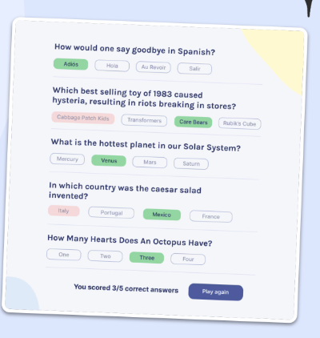

# Quizzical Trivia App
## Scrimba Solo Project (React)

### [Live Version](https://rapidisimo.github.io/Quizzical/)

## My Objectives
Initial Objectives: Build a working React quizz app that makes use of an API.

## Requirements
1. Two Screens (Start & Questions)
2. Pull 5 questions from the OTDB API
3. Tally correct answers after "Check Answers" is clicked
4. Styled & Polished

## Additional Work Beyond Requirements
TBA

### Question/Challenges
TBA

### Update

## Preview

