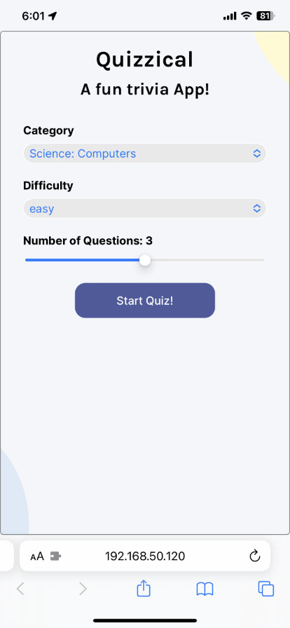
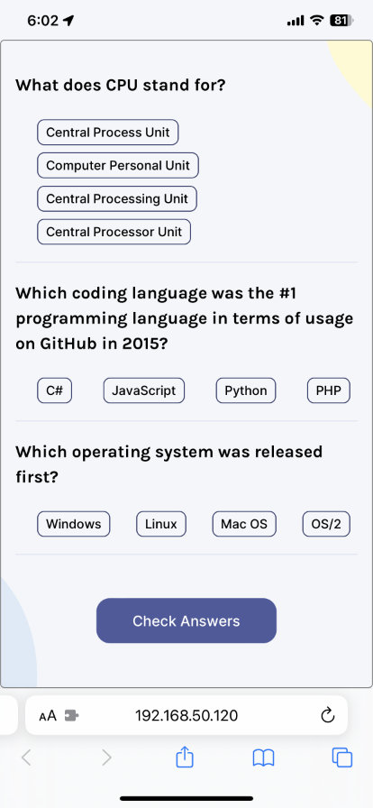
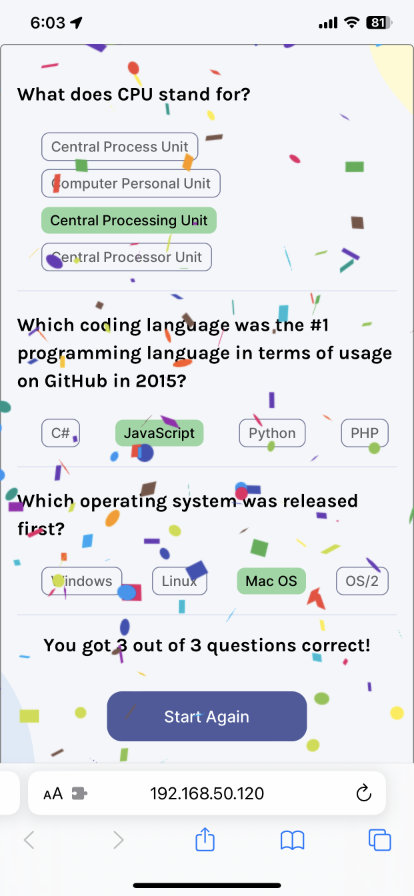
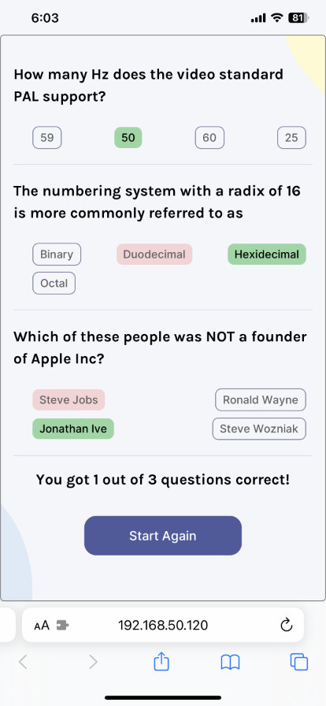

# Quizzical Trivia App
## Scrimba Solo Project (React)

### [Live Version](https://rapidisimo.github.io/Quizzical/)

## My Objectives
Build a working React quiz app that makes use of an API.
Always keep in mind the user experience they have with the app.

## Requirements
1. ✅ Two Screens (Start & Questions)
2. ✅ Pull 5 questions from the OTDB API
3. ✅ Tally correct answers after "Check Answers" is clicked
4. ✅ Styled & Polished

## Additional Work Beyond Requirements
1. ⭐️ Mobile first approach
2. ⭐️ Ability to choose Category
3. ⭐️ Ability to choose Difficulty
4. ⭐️ Ability to choose Number of Questions (I limited it to 5 Max)
5. ⭐️ Verify that all questions have been answered before running check and display message for the user
6. ⭐️ Loading animation while/if the data from the API takes a bit to display.
7. ⭐️ Dark color scheme based on system/user preference

### Challenges
- Dealing with asynchronous nature of State and getting comfortable with useEffect
- Many conditional rendering items/events
- CSS specificity for selected radio buttons
- Assigning a CSS class to an answer based on if the user answered correctly, incorrectly or the answer was not chosen.
- Mobile first approach

## Preview

